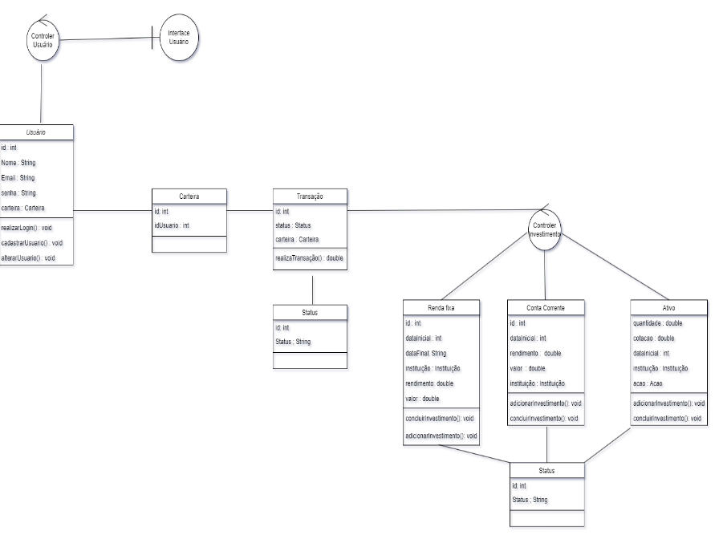

# Implementação do GoldInvesting

Bem-vindo ao guia da aplicação GoldInvesting. Esta aplicação é dividida em duas partes principais: um backend em Java Spring Boot e um frontend em React.js. Utilizamos Docker e Docker Compose para containerizar a aplicação, simplificando seu desenvolvimento e implantação.

## Estrutura do Projeto

A aplicação está organizada em dois diretórios principais:

- **Backend:** Localizado em `backend/goldinvesting`, é uma aplicação Spring Boot executando em Java 21.
- **Frontend:** Localizado em `frontend/goldinvesting`, é uma aplicação React.js.

## Funcionalidades

A aplicação GoldInvesting oferece as seguintes funcionalidades principais:

1. **Cadastro e Login de Usuários**:
   - Rota de Cadastro: `POST /users`
   - Rota de Login: `POST /users/authenticate`
   - Rota de Obter Usuário por ID: `GET /users/{id}`
   - Rota de Listar Usuários: `GET /users`
   - Rota de Atualizar Usuário: `PUT /users`
   - Rota de Deletar Usuário: `DELETE /users/{id}`

2. **Criação de Corretoras**:
   - Rota de Criação de uma nova corretora: `POST /brokers`
   - Rota de Obter Corretoras por ID: `GET /brokers/{id}`
   - Rota de Listar Corretoras: `GET /brokers`
   - Rota de Deletar Corretoras: `DELETE /brokers/{id}`

3. **Adicionar Investimentos em Conta Corrente**:
   - Rota de Criação de Conta Corrente: `POST /checking-accounts`
   - Rota de Obter Conta Corrente por ID: `GET /checking-accounts/{id}`
   - Rota de Listar Contas Correntes: `GET /checking-accounts`
   - Rota de Deletar Conta Corrente: `DELETE /checking-accounts/{id}`
   - Rota de Concluir Conta Corrente: `PUT /checking-accounts/conclude/{id}`

## Arquitetura Hexagonal

O backend do projeto GoldInvesting segue a arquitetura hexagonal (Ports and Adapters), que facilita a separação de responsabilidades e a testabilidade do código. Essa abordagem permite que a lógica de negócios seja independente dos detalhes de implementação, como frameworks e bibliotecas externos. As portas (ports) definem interfaces que a lógica de negócios expõe, enquanto os adaptadores (adapters) implementam essas interfaces para interagir com o mundo exterior (ex.: APIs, banco de dados).

## Diagrama de Classes

A seguir está o diagrama de classes da aplicação GoldInvesting:



Este diagrama ilustra a estrutura do sistema, incluindo as principais entidades, seus atributos e métodos, bem como as relações entre elas.

## Banco de Dados SQL

O banco de dados utilizado no projeto é o MySQL. Abaixo estão algumas das principais tabelas e seus relacionamentos:

- **Usuário:** Contém informações dos usuários, como nome, email e senha.
- **Carteira:** Armazena as carteiras dos usuários, que podem conter diversas transações e investimentos.
- **Transação:** Representa uma transação financeira, vinculada a uma carteira específica.
- **Conta Corrente:** Representa uma conta corrente onde os investimentos são adicionados.
- **Renda Fixa:** Armazena informações sobre investimentos de renda fixa.
- **Ativo:** Contém dados sobre os ativos, como ações e suas cotações.
Aqui está a versão atualizada do README em português, incluindo uma seção sobre os testes unitários realizados no backend:

## Banco de Dados SQL

O banco de dados utilizado no projeto é o MySQL. Abaixo estão algumas das principais tabelas e seus relacionamentos:

- **Usuário:** Contém informações dos usuários, como nome, email e senha.
- **Carteira:** Armazena as carteiras dos usuários, que podem conter diversas transações e investimentos.
- **Transação:** Representa uma transação financeira, vinculada a uma carteira específica.
- **Conta Corrente:** Representa uma conta corrente onde os investimentos são adicionados.
- **Renda Fixa:** Armazena informações sobre investimentos de renda fixa.
- **Ativo:** Contém dados sobre os ativos, como ações e suas cotações.

As operações no banco de dados são realizadas através de consultas SQL, utilizando o ORM do Spring Boot para facilitar a interação com o MySQL.

## Testes Unitários

Os testes unitários no backend do projeto GoldInvesting são realizados utilizando JUnit, um framework popular para testes em Java. Esses testes garantem que as diferentes partes do código funcionem conforme esperado, ajudando a identificar e corrigir erros durante o desenvolvimento. 

Os testes cobrem as seguintes áreas:

- **Serviços:** Testes das classes de serviço para verificar a lógica de negócios.
- **Controladores:** Testes dos endpoints da API para assegurar que as requisições e respostas estejam corretas.
- **Repositórios:** Testes das interações com o banco de dados, garantindo que as operações de CRUD funcionem corretamente.

Exemplo de teste unitário para o serviço de usuários:

```java
import static org.junit.jupiter.api.Assertions.assertEquals;
import static org.mockito.Mockito.when;

import br.com.goldinvesting.application.dto.UserDTO;
import br.com.goldinvesting.application.ports.in.UserUseCase;
import br.com.goldinvesting.domain.model.User;
import br.com.goldinvesting.infrastructure.adapters.in.api.UserController;
import org.junit.jupiter.api.Test;
import org.mockito.InjectMocks;
import org.mockito.Mock;
import org.mockito.MockitoAnnotations;
import org.springframework.http.ResponseEntity;

public class UserControllerTest {

    @Mock
    private UserUseCase userUseCase;

    @InjectMocks
    private UserController userController;

    @Test
    void testCreateUser() {
        MockitoAnnotations.openMocks(this);
        
        UserDTO userDTO = new UserDTO();
        userDTO.setName("John Doe");
        
        when(userUseCase.createUser(userDTO)).thenReturn(userDTO);
        
        ResponseEntity<UserDTO> response = userController.createUser(userDTO);
        
        assertEquals(200, response.getStatusCodeValue());
        assertEquals("John Doe", response.getBody().getName());
    }
}
```

Estes testes são executados durante o ciclo de desenvolvimento para garantir que o código continue funcionando conforme novas funcionalidades são adicionadas ou alterações são feitas.

## Criação das tabelas

Utilizando JPA e SpringBoot, as tabelas são criadas "automaticamente" ao iniciar o serviço. No entanto, com fim de disponibilizar a plena utilização, esse é um exemplo de arquivo SQL criado para criação de tabelas para o funcionamento do app GoldInvesting:
```sql
CREATE TABLE Broker (
    id BIGINT AUTO_INCREMENT PRIMARY KEY,
    name VARCHAR(100) NOT NULL
);

CREATE TABLE StockDB (
    id VARCHAR(255) PRIMARY KEY,
    name VARCHAR(100) NOT NULL
);

CREATE TABLE InvestmentType (
    id BIGINT AUTO_INCREMENT PRIMARY KEY,
    investmentType VARCHAR(100) NOT NULL
);

CREATE TABLE Status (
    id BIGINT AUTO_INCREMENT PRIMARY KEY,
    status VARCHAR(50) NOT NULL
);

CREATE TABLE User (
    id BIGINT AUTO_INCREMENT PRIMARY KEY,
    name VARCHAR(100) NOT NULL,
    email VARCHAR(100) NOT NULL,
    password VARCHAR(100) NOT NULL
);

CREATE TABLE Wallet (
    id BIGINT AUTO_INCREMENT PRIMARY KEY,
    user_id BIGINT NOT NULL,
    balance DOUBLE,
    CONSTRAINT FK_UserWallet FOREIGN KEY (user_id) REFERENCES User(id)
);

ALTER TABLE User
ADD CONSTRAINT FK_UserWallet FOREIGN KEY (wallet_id) REFERENCES Wallet(id);

CREATE TABLE Investment (
    id BIGINT PRIMARY KEY,
    title VARCHAR(255),
    yieldRate DOUBLE,
    initialDate DATE,
    initialValue DOUBLE,
    broker_id BIGINT,
    paper VARCHAR(255),
    issuer VARCHAR(255),
    finalDate DATE,
    stock_id VARCHAR(255),
    quantity DOUBLE,
    price DOUBLE,
    CONSTRAINT FK_InvestmentBroker FOREIGN KEY (broker_id) REFERENCES Broker(id),
    CONSTRAINT FK_InvestmentStock FOREIGN KEY (stock_id) REFERENCES StockDB(id)
);

CREATE TABLE CheckingAccount (
    id BIGINT AUTO_INCREMENT PRIMARY KEY,
    title VARCHAR(100) NOT NULL,
    yieldRate DOUBLE CHECK (yieldRate > 0.0),
    initialDate DATE NOT NULL CHECK (initialDate <= CURDATE()),
    initialValue DOUBLE CHECK (initialValue > 0.0),
    broker_id BIGINT NOT NULL,
    CONSTRAINT FK_CheckingAccountBroker FOREIGN KEY (broker_id) REFERENCES Broker(id)
);

CREATE TABLE Stock (
    id BIGINT AUTO_INCREMENT PRIMARY KEY,
    stock_id VARCHAR(255) NOT NULL,
    broker_id BIGINT NOT NULL,
    quantity DOUBLE CHECK (quantity > 0.0),
    initialValue DOUBLE CHECK (initialValue > 0.0),
    initialDate DATE NOT NULL CHECK (initialDate <= CURDATE()),
    price DOUBLE CHECK (price > 0.0),
    CONSTRAINT FK_StockStockDB FOREIGN KEY (stock_id) REFERENCES StockDB(id),
    CONSTRAINT FK_StockBroker FOREIGN KEY (broker_id) REFERENCES Broker(id)
);

CREATE TABLE Transaction (
    id BIGINT AUTO_INCREMENT PRIMARY KEY,
    investment_id BIGINT,
    investmentType_id BIGINT NOT NULL,
    wallet_id BIGINT NOT NULL,
    status_id BIGINT NOT NULL,
    CONSTRAINT FK_TransactionInvestment FOREIGN KEY (investment_id) REFERENCES Investment(id),
    CONSTRAINT FK_TransactionInvestmentType FOREIGN KEY (investmentType_id) REFERENCES InvestmentType(id),
    CONSTRAINT FK_TransactionWallet FOREIGN KEY (wallet_id) REFERENCES Wallet(id),
    CONSTRAINT FK_TransactionStatus FOREIGN KEY (status_id) REFERENCES Status(id)
);

CREATE TABLE TreasuryDirect (
    id BIGINT AUTO_INCREMENT PRIMARY KEY,
    title VARCHAR(100) NOT NULL,
    issuer VARCHAR(100) NOT NULL,
    yieldRate DOUBLE CHECK (yieldRate > 0.0),
    initialDate DATE NOT NULL CHECK (initialDate <= CURDATE()),
    finalDate DATE NOT NULL,
    initialValue DOUBLE CHECK (initialValue > 0.0),
    broker_id BIGINT NOT NULL,
    CONSTRAINT FK_TreasuryDirectBroker FOREIGN KEY (broker_id) REFERENCES Broker(id)
);

CREATE TABLE FixedIncomeModel (
    id BIGINT AUTO_INCREMENT PRIMARY KEY,
    paper VARCHAR(100) NOT NULL,
    issuer VARCHAR(100) NOT NULL,
    yieldRate DOUBLE CHECK (yieldRate > 0.0),
    initialDate DATE NOT NULL CHECK (initialDate <= CURDATE()),
    finalDate DATE NOT NULL,
    initialValue DOUBLE CHECK (initialValue > 0.0),
    broker_id BIGINT NOT NULL,
    CONSTRAINT FK_FixedIncomeModelBroker FOREIGN KEY (broker_id) REFERENCES Broker(id)
);

```
---
